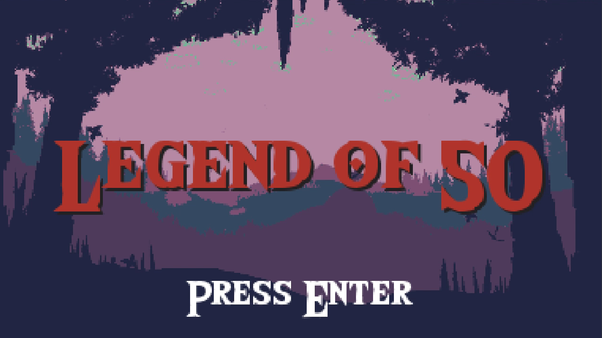
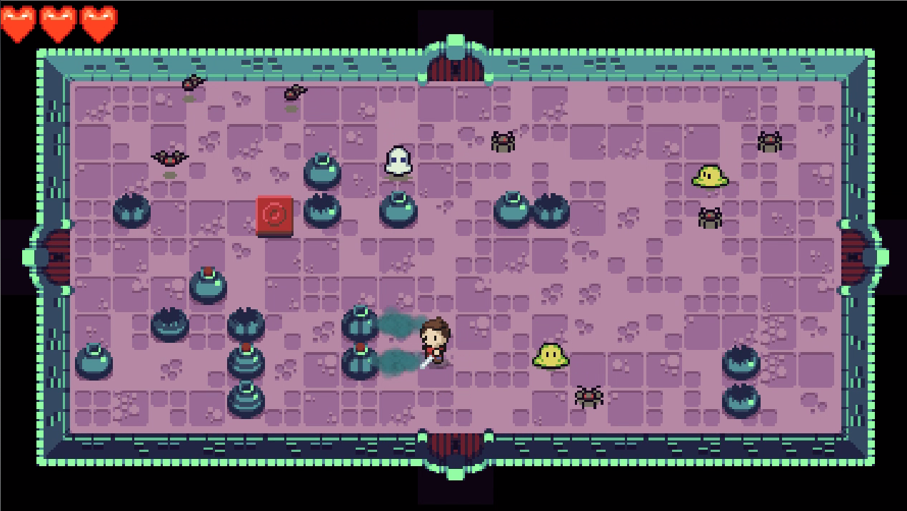
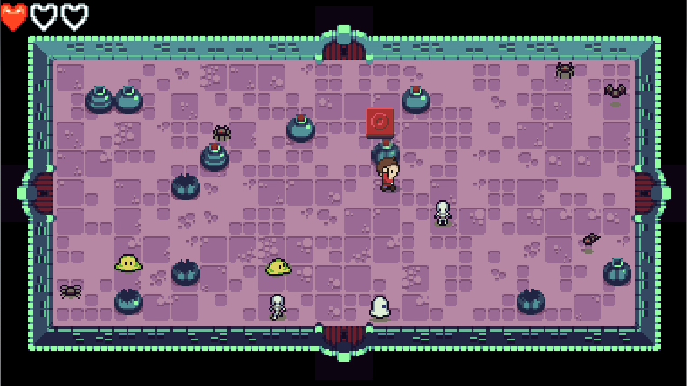

# Legend of 50

Project 5 of [CS50's Introduction to Games Development](https://cs50.harvard.edu/games/2018/)

*Legend of 50* is a game heavily inspired by the SNES Legend of Zelda titles and implemented in the [LÖVE2D](https://love2d.org/) framework. For this project, I added several new features to the distribution code; breakable pots, a projectile system, and pickups/powerups.

[Full project specification](https://cs50.harvard.edu/games/2018/projects/5/zelda/).

## Setup
First, clone this repository:
```bash
git clone https://github.com/calumbell/cs50g-legend-of-50
```
Install **LÖVE2D** (v10.2) - [click here for installation instructions](https://love2d.org/wiki/Getting_Started)

To run the game:
```bash
cd legend-of-50
love .
```

## Visuals
You can see a video demonstration of this project [here](https://youtu.be/nb676X_qNw8).






## Requirements
*Legend of 50* was built using the [LÖVE2D](https://love2d.org/) framework (version 10.2)

[Push](https://github.com/Ulydev/push) was used for resolution-handling, [hump](https://github.com/vrld/hump/blob/master/class.lua) was used for Lua object-orientation, and [Knife](https://github.com/airstruck/knife) was used to handle asynchronous code, chained functions, tweening, etc.
